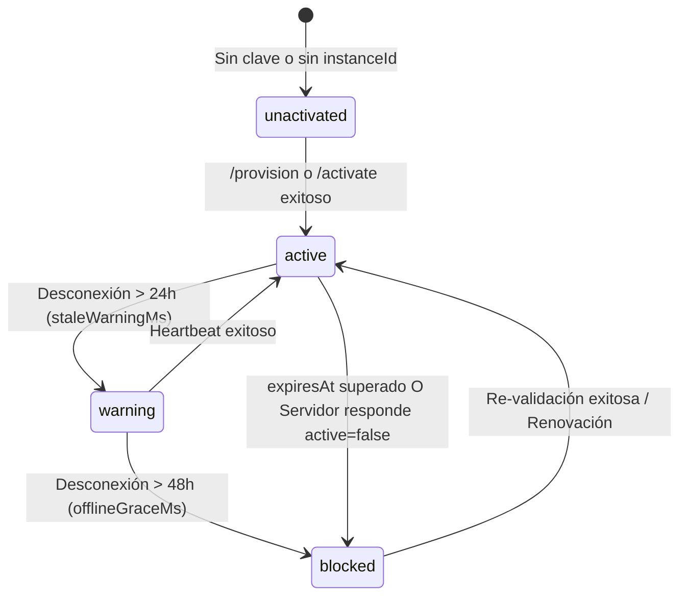

# AGENTS.md — Guía Operativa y de Arquitectura para Agentes IA en Wootrico v2

Bienvenido a **Wootrico v2**. Este documento sirve como manual de referencia, directriz arquitectónica y protocolo operativo para cualquier agente de inteligencia artificial (o desarrollador) que trabaje, depure o extienda este repositorio.

---

## 1. Visión General del Proyecto

**Wootrico v2** es un middleware empresarial *self-hosted* que conecta [Chatwoot](https://github.com/chatwoot/chatwoot) con APIs no oficiales de WhatsApp (**Evolution Go**, **UAZAPI** y **Z-API**).

### Objetivos Clave
- **Sin infierno de variables de entorno**: Configuración centralizada vía panel web oscuro (*dark mode*).
- **Multi-empresa y Multi-inbox**: Múltiples números, bandejas de entrada e instancias distribuidas con diferentes proveedores en una única instalación.
- **Orden estricto sin retrasos artificiales**: Bloqueo distribuido por conversación en Redis (`withLock`) para garantizar entrega FIFO exacta sin introducir *sleeps* o retardos arbitrarios.
- **Deduplicación Robusta**: Manejo integral de 4 escenarios de eco/duplicidad (móvil, agente, reintentos de webhook de proveedor y Chatwoot).
- **Privacy-by-Design & LGPD**: Cero almacenamiento de contenido de mensajes en reposo en la base de datos principal; los payloads viajan efímeramente a través de RabbitMQ.
- **Directorio Canónico de Identidades (LID vs PN)**: Mapeo y reconciliación global entre identificadores de privacidad de WhatsApp (`@lid`) y números telefónicos (`@s.whatsapp.net`).
- **Sistema de Licenciamiento de Doble Capa**: Validación 100% online con secreto criptográfico derivado vía HKDF (`L1:` prefix) que sella las credenciales de los proveedores en base de datos.

---

## 2. Mapa Tecnológico y Arquitectura del Monorepo

El repositorio es un monorepo gestionado con **`pnpm` workspaces** (Node.js >= 20, pnpm 10.x).

```
wootrico-egs/
├── apps/
│   ├── panel-api/          # Backend API Fastify (Puerto 3000) e Ingress de Webhooks
│   ├── panel-web/          # Dashboard SPA React + Vite + Tailwind CSS para el cliente
│   ├── worker/             # Motor de procesamiento en segundo plano (RabbitMQ consumers)
│   ├── license-server/     # Servidor de licencias Fastify (Puerto 4000) exclusivo del proveedor
│   ├── license-admin-web/  # Dashboard SPA React + Vite para administración de licencias del vendor
│   └── landing-web/        # Landing page y documentación pública (React + Vite)
├── packages/
│   ├── config/             # Variables de entorno (Zod), Logger (Pino), Constantes, Criptografía
│   ├── db/                 # Prisma ORM, cliente singleton y gestor dinámico de conexiones
│   ├── types/              # Definiciones e interfaces TypeScript transversales
│   ├── providers/          # Abstracción de WhatsApp (Evolution, UAZAPI, Z-API)
│   ├── chatwoot-client/    # Cliente HTTP tipado para Chatwoot API
│   ├── queue/              # RabbitMQ (amqplib) con reconexión automática y confirmación
│   ├── cache/              # Redis con soporte de Mutexes (`withLock`), throttle y caché
│   ├── storage/            # Drivers de almacenamiento de medios (Postgres MediaBlob y S3/MinIO)
│   └── license-client/     # Máquina de estados y cliente de validación de licencias
├── scripts/                # Suites de pruebas E2E con servidores mock y utilidades operativas
├── Dockerfile              # Construcción multi-stage de imágenes aisladas
└── docker-compose.*.yml    # Configuraciones de despliegue para desarrollo, Swarm y Coolify
```

---

## 3. Invariantes Arquitectónicos Críticos (Reglas No Negociables)

Cualquier cambio propuesto por un agente **DEBE** respetar estrictamente los siguientes principios:

### 3.1. Separación Estricta de Imágenes Docker (`Dockerfile`)
El [Dockerfile](file:///d:/BDeveloper/ChatComunication/wootrico-egs/Dockerfile) genera **dos imágenes totalmente independientes**:
1. `runtime-app` (**CLIENTE**): Contiene `panel-api`, `panel-web` y `worker`.
   - **REGLA**: El build ejecuta `rm -rf apps/license-server apps/license-admin-web`. **NUNCA** debes permitir que el código del servidor de licencias quede expuesto en la imagen del cliente.
2. `runtime-license` (**PROVEEDOR**): Contiene `license-server` y `license-admin-web`.
   - **REGLA**: El build ejecuta `rm -rf apps/panel-api apps/panel-web apps/worker`.

### 3.2. Privacidad y LGPD (Zero Content in DB)
- Los webhooks de WhatsApp y Chatwoot ingresan por [apps/panel-api/src/routes/webhooks.ts](file:///d:/BDeveloper/ChatComunication/wootrico-egs/apps/panel-api/src/routes/webhooks.ts).
- El cuerpo del mensaje sin procesar (*raw payload*) viaja **ÚNICAMENTE** como mensaje efímero en RabbitMQ (`WebhookJob` en [packages/queue/src/index.ts](file:///d:/BDeveloper/ChatComunication/wootrico-egs/packages/queue/src/index.ts)).
- El modelo `WebhookEvent` en PostgreSQL es un registro de auditoría sin PII (`accepted`, `source`, `originDetected`, `eventType`). **NUNCA** persistas el JSON del mensaje en esta tabla.
- El modelo `MessageLog` contiene únicamente metadatos semánticos (`direction`, `messageType`, `kind`, `hasMedia`, `isReply`, `isGroup`).
- El modelo `ConversationMessage` solo registra texto para vista previa/historial si la licencia está activa o durante su captura previa en `inbound.ts`, y se somete a depuración periódica según `AppSettings.conversationRetentionDays`.

### 3.3. Reconciliación de Identidades (LID vs Phone Number)
- WhatsApp utiliza números de teléfono (`@s.whatsapp.net`) y LIDs de privacidad (`@lid`).
- En [apps/worker/src/engine/identity.ts](file:///d:/BDeveloper/ChatComunication/wootrico-egs/apps/worker/src/engine/identity.ts), ambos identificadores se reconcilian en un registro único y canónico `ContactIdentity`.
- Este directorio es global a nivel de instancia: si la Empresa A descubre el número asociado a un LID, la Empresa B se beneficia de esa asociación sin compartir sus conversaciones de Chatwoot.
- Al responder o enviar mensajes, siempre se debe usar el identificador que la integración respectiva recibió originalmente.

### 3.4. Deduplicación en 4 Escenarios
El worker en [apps/worker/src/handlers/inbound.ts](file:///d:/BDeveloper/ChatComunication/wootrico-egs/apps/worker/src/handlers/inbound.ts) y [apps/worker/src/handlers/chatwoot-callback.ts](file:///d:/BDeveloper/ChatComunication/wootrico-egs/apps/worker/src/handlers/chatwoot-callback.ts) implementa:
1. **Eco de WhatsApp Web/Móvil (`fromMe`)**: Se sincroniza hacia Chatwoot como mensaje saliente (`outgoing`) sin reenviarlo al teléfono.
2. **Eco de Mensaje Enviado por Agente**: Cuando Chatwoot notifica `message_created` saliente, se envía a WhatsApp y se registra `MessageMapping` y `DedupTicket`. Si el proveedor luego emite un webhook de eco, se detecta y se descarta.
3. **Reentrega del Proveedor**: Si el proveedor de WhatsApp dispara múltiples webhooks con el mismo `providerMessageId`, se detecta vía `getMappingByProviderId` y se omite.
4. **Reentrega de Chatwoot**: Si Chatwoot reenvía el callback, se detecta vía `getMappingByChatwootId`.

### 3.5. Criptografía y Sellado de Licencia (`L1:`)
- En [packages/config/src/crypto.ts](file:///d:/BDeveloper/ChatComunication/wootrico-egs/packages/config/src/crypto.ts), los tokens de Chatwoot y credenciales de proveedores se cifran con AES-256-GCM.
- Con el sistema de licenciamiento activo, se usa `encryptSecret`: la clave AES se deriva mediante HKDF-SHA256 combinando `APP_ENCRYPTION_KEY` y el `licenseSecret` entregado por el servidor de licencias (`L1:...`).
- **Consecuencia**: Una copia pirata o un parche que intente forzar `license.allowed = true` sin el secreto no podrá descifrar las credenciales de integración de la base de datos.

### 3.6. Concurrencia y Bloqueo con Redis
- Para evitar carreras donde un mensaje posterior llega antes que uno anterior a Chatwoot o WhatsApp, **SIEMPRE** se adquiere el candado distribuido `withLock(lockKey)` (con TTL de 15 segundos y reintentos automáticos).
- **NUNCA** uses `setTimeout` ni esperas arbitrarias para simular orden en la cola.

---

## 4. Topología de RabbitMQ

Definida en [packages/config/src/constants.ts](file:///d:/BDeveloper/ChatComunication/wootrico-egs/packages/config/src/constants.ts):

| Componente | Nombre | Tipo / Propósito |
|---|---|---|
| Exchange Principal | `wootrico` | `direct` |
| Exchange de Reintentos | `wootrico.retry` | `fanout` -> `wootrico.retry.q` (TTL 10s) |
| Exchange DLX | `wootrico.dlx` | `fanout` -> `wootrico.dead` |
| Cola Inbound | `wootrico.inbound` | Webhooks de proveedores de WhatsApp |
| Cola Callback | `wootrico.callback` | Webhooks originados en Chatwoot |

- Los consumidores de [packages/queue/src/index.ts](file:///d:/BDeveloper/ChatComunication/wootrico-egs/packages/queue/src/index.ts) se re-registran automáticamente con retroceso exponencial (*jittered backoff*) si la conexión AMQP cae.
- Las publicaciones a la cola usan canales de confirmación (`ConfirmChannel`) con un tiempo límite de 10s para no congelar los endpoints ante alarmas de memoria/disco en RabbitMQ.

---

## 5. Esquema de Base de Datos Principal y del Servidor de Licencias

### 5.1. Base de Datos de la Aplicación ([packages/db/prisma/schema.prisma](file:///d:/BDeveloper/ChatComunication/wootrico-egs/packages/db/prisma/schema.prisma))
Modelos centrales del cliente:
- **`AdminUser` / `Session`**: Autenticación del panel del cliente (JWT con refresh token rotativo).
- **`Integration`**: Configuración de enlace Chatwoot ↔ Proveedor de WhatsApp con flags de comportamiento (`reabrirConversa`, `desconsiderarGrupo`, `assinarMensagem`).
- **`ProviderConfig`**: Credenciales cifradas del proveedor (`evolution`, `uazapi`, `zapi`) selladas con `L1:`.
- **`ContactIdentity` / `ContactAvatar`**: Directorio global de resolución de teléfonos y LIDs con almacenamiento binario local de avatares.
- **`MessageMapping`**: Asociación bidireccional entre `chatwootMessageId` y `providerMessageId`.
- **`MediaAsset` / `MediaBlob`**: Catálogo de medios enviados/recibidos y almacenamiento binario local o S3.
- **`Conversation` / `ConversationMessage`**: Historial y vista previa de mensajes para el panel con TTL de expiración.
- **`DedupTicket`**: Tickets de deduplicación de corto plazo.
- **`LicenseState`**: Estado singleton de la licencia local (modo trial/paid, soporte WhatsApp, llaves selladas).
- **`AppSettings`**: Configuración global singleton (retención de logs, driver de medios, sobrescritura cifrada de URLs de conexión).

### 5.2. Base de Datos del Servidor de Licencias ([apps/license-server/prisma/schema.prisma](file:///d:/BDeveloper/ChatComunication/wootrico-egs/apps/license-server/prisma/schema.prisma))
Base de datos aislada administrada exclusivamente por el vendor:
- **`LicenseKey`**: Registro maestro de claves emitidas (`keyHash` SHA-256, `plan`, `expiresAt`, `revokedAt`, `secret`, `issuedKey`, `maxActivations`).
- **`Activation`**: Instancias vinculadas (`instanceId`, `firstIp`, `lastIp`, `appVersion`, `publicBaseUrl`, `lastHeartbeatAt`).
- **`PurchaseIntent`**: Registro de intenciones de compra pendientes y saldadas con enlace de rastreo `sck`.
- **`Payment`**: Libro mayor (*ledger*) de pagos recibidos vía Hotmart o webhook genérico.
- **`WebhookKey`**: Tokens `Bearer WHK-...` autorizados para invocación de pagos externos.
- **`SupportTicket`**: Solicitudes de soporte abiertas directamente desde el panel cliente.
- **`HeartbeatLog` & `LicenseEvent`**: Telemetría y auditoría de accesos e IPs sin PII.
- **`ServerSettings`**: Configuración singleton de checkout, webhook Hotmart, soporte WhatsApp y retención de logs.

---

## 6. Arquitectura Exhaustiva de la Capa de Licenciamiento (Cliente y Servidor)

La capa de licenciamiento de **Wootrico v2** es un subsistema de **doble barrera criptográfica y validación continua** diseñado para impedir la ejecución no autorizada, proteger las credenciales operativas y automatizar el ciclo comercial (pruebas, pagos, renovaciones y soporte).

```
┌────────────────────────────────────────────────────────────────────────────────────────┐
│                                   CLIENT INSTANCE                                      │
│                                                                                        │
│   ┌────────────────────┐   heartbeat / validate     ┌──────────────────────────────┐   │
│   │   panel-web (UI)   │ ─────────────────────────> │   packages/license-client    │   │
│   └────────────────────┘                            │  - state-machine.ts          │   │
│             │                                       │  - store.ts (LicenseState)   │   │
│             ▼                                       │  - activation.ts             │   │
│   ┌────────────────────┐                            │  - heartbeat.ts              │   │
│   │   panel-api        │ <─ assertLicenseActive() ─ │  - fingerprint.ts            │   │
│   │  - license routes  │                            └──────────────┬───────────────┘   │
│   │  - webhook ingress │                                           │                   │
│   └─────────┬──────────┘                                           │ decryptSecret()   │
│             │ publish                                              ▼                   │
│             ▼                                       ┌──────────────────────────────┐   │
│   ┌────────────────────┐                            │    packages/config/crypto    │   │
│   │   RabbitMQ queue   │                            │  HKDF(APP_KEY, licenseSecret)│   │
│   └─────────┬──────────┘                            │   AES-256-GCM  ("L1:...")    │   │
│             ▼                                       └──────────────────────────────┘   │
│   ┌────────────────────┐                                                               │
│   │   worker engine    │ <── assertLicenseActive() + tryDecrypt(secrets)               │
│   └────────────────────┘                                                               │
└────────────────────────────────────────┬───────────────────────────────────────────────┘
                                         │  HTTPS (REST / JSON)
                                         ▼
┌────────────────────────────────────────────────────────────────────────────────────────┐
│                              VENDOR INFRASTRUCTURE                                     │
│                                                                                        │
│   ┌─────────────────────────────┐           ┌──────────────────────────────────────┐   │
│   │   apps/license-server       │           │   apps/license-admin-web             │   │
│   │   - Fastify (Puerto 4000)   │ <───────> │   - React SPA Dashboard              │   │
│   │   - /provision & /activate  │           │   - Gestión de claves y usuarios     │   │
│   │   - /validate & /heartbeat  │           │   - Auditoría de IPs y pagos         │   │
│   │   - /webhook/hotmart        │           └──────────────────────────────────────┘   │
│   │   - Google OAuth Broker     │                                                      │
│   └──────────────┬──────────────┘                                                      │
│                  ▼                                                                     │
│   ┌─────────────────────────────┐                                                      │
│   │  PostgreSQL (Licencias)     │                                                      │
│   └─────────────────────────────┘                                                      │
└────────────────────────────────────────────────────────────────────────────────────────┘
```

### 6.1. Componentes del Ecosistema

1. **Cliente de Licencia (`@wootrico/license-client`)**: Biblioteca compartida en [packages/license-client/](file:///d:/BDeveloper/ChatComunication/wootrico-egs/packages/license-client/) que gestiona la máquina de estados local, consulta la base de datos (`license_state`), almacena los secretos y coordina la comunicación con el servidor central.
2. **Servidor de Licencias (`apps/license-server`)**: Servicio Fastify independiente en [apps/license-server/](file:///d:/BDeveloper/ChatComunication/wootrico-egs/apps/license-server/) ejecutado en el puerto `4000`, conectado a su propia base de datos PostgreSQL (`LICENSE_DATABASE_URL`).
3. **Panel de Control del Vendedor (`apps/license-admin-web`)**: SPA React + Vite + Tailwind en [apps/license-admin-web/](file:///d:/BDeveloper/ChatComunication/wootrico-egs/apps/license-admin-web/) para gestión de altas manuales, monitoreo de salud, métricas financieras y resolución de tickets.
4. **Panel del Cliente (`apps/panel-web` y `apps/panel-api`)**: UI en [apps/panel-web/src/pages/License.tsx](file:///d:/BDeveloper/ChatComunication/wootrico-egs/apps/panel-web/src/pages/License.tsx) y rutas en [apps/panel-api/src/routes/license.ts](file:///d:/BDeveloper/ChatComunication/wootrico-egs/apps/panel-api/src/routes/license.ts) que permiten el registro transparente por autoservicio, activación por clave, compra y tickets de soporte.

### 6.2. Máquina de Estados Local ([state-machine.ts](file:///d:/BDeveloper/ChatComunication/wootrico-egs/packages/license-client/src/state-machine.ts))

El estado de la licencia se evalúa dinámicamente mediante `computeStatus(state, now)`:



| Estado (`LicenseStatus`) | Procesamiento Permitido | Descripción y Criterio de Transición |
|---|---|---|
| `unactivated` | ❌ No | La instancia acaba de instalarse y no tiene clave configurada ni `instanceId` enlazado. |
| `active` | ✅ Sí | Licencia validada exitosamente con el servidor central dentro de la ventana de vigencia. |
| `warning` | ✅ Sí | El servidor no ha respondido durante más de 24 horas (`LICENSE.staleWarningMs`), pero menos de 48 horas. Se tolera la caída temporal de red sin interrumpir el flujo de mensajes. |
| `blocked` | ❌ No | Ocurre por: **(a)** respuesta explícita del servidor `active: false` (motivos: `expired`, `trial_expired`, `revoked`, `invalid_key`, `inactive`), **(b)** vencimiento del reloj local (`now >= expiresAt`), o **(c)** desconexión continua superior a 48 horas (`LICENSE.offlineGraceMs`). El bloqueo por desconexión es **recuperable automáticamente** en cuanto el servidor responda de nuevo. |

### 6.3. Motor de Validación, Heartbeat y Resiliencia Offline ([heartbeat.ts](file:///d:/BDeveloper/ChatComunication/wootrico-egs/packages/license-client/src/heartbeat.ts))

- **Intervalo Base y Jitter**: Las instancias revalidan su estado cada 6 horas (`LICENSE.validateIntervalMs`). Para prevenir el problema de la avalancha (*thundering herd*), se aplica una variación aleatoria (*jitter*) de ±10% (`LICENSE.validateJitterRatio = 0.1`).
- **Tick del Worker**: El proceso worker ejecuta `maybeRunHeartbeat()` cada 30 minutos (`LICENSE.heartbeatTickMs`). Esta verificación es ligera: no realiza peticiones de red a menos que la marca de tiempo `nextHeartbeatAt` haya expirado.
- **Retroceso Exponencial ante Fallas (*Backoff*)**: Si el servidor de licencias no está disponible o responde con error 5xx, la instancia incrementa `heartbeatFailures` y retrasa el siguiente intento (6h → 12h → 24h máximo, definido en `LICENSE.validateBackoffMaxMs`). La clave **no se bloquea de inmediato**.
- **Entrega Transparente de Nuevas Claves**: Si el cliente actualizó su plan (por ejemplo, compra aprobada en Hotmart), el endpoint `/validate` entrega la nueva clave en la respuesta (`data.key`). El cliente la persiste de forma transparente sin intervención humana.
- **Hot-Polling en UI**: Cuando el administrador abre la pantalla de Licencia en [apps/panel-web/src/pages/License.tsx](file:///d:/BDeveloper/ChatComunication/wootrico-egs/apps/panel-web/src/pages/License.tsx), se activa un sondeo acelerado (cada 25s si está bloqueado, cada 45s si está activo). Esto permite que acciones del vendor (activación manual, extensión de días) se reflejen casi en tiempo real.

### 6.4. Sellado Criptográfico de Credenciales (`L1:`) ([crypto.ts](file:///d:/BDeveloper/ChatComunication/wootrico-egs/packages/config/src/crypto.ts))

Para garantizar que un parche de software o un falso servidor de licencias no pueda desbloquear el middleware, Wootrico v2 implementa una **doble derivación de claves criptográficas**:

1. **Clave Maestra Local**: `APP_ENCRYPTION_KEY` (32 bytes aleatorios en base64).
2. **Secreto de Licencia (`licenseSecret`)**: Token de 32 bytes base64url emitido por el servidor de licencias y entregado únicamente a instancias con licencia activa.
3. **Derivación HKDF**:
   $$\text{AES\_KEY} = \text{HKDF-SHA256}(\text{ikm} = \text{APP\_ENCRYPTION\_KEY},\, \text{salt} = \text{licenseSecret},\, \text{info} = \text{"wootrico-license-seal-v1"},\, \text{len} = 32)$$
4. **Formato del Ciphertext**:
   $$\text{L1:} \,+\, \text{Base64}(\text{IV [12 bytes]} \,\|\, \text{AuthTag [16 bytes]} \,\|\, \text{Ciphertext})$$
5. **Historial de Secretos (`dataKeys`)**: Cuando una licencia se reactiva o cambia, `license_state.data_keys` mantiene un array JSON cifrado con todos los secretos históricos de la instancia. La función `decryptSecretAny()` intenta descifrar con cada candidato, garantizando que integraciones configuradas previamente sigan funcionando.

### 6.5. Servidor de Licencias (`apps/license-server`) y Endpoints

El servidor expone una API REST construida sobre Fastify con validación estricta vía Zod:

#### Endpoints Públicos / Instancia
- `GET /health`: Comprobación de salud básica.
- `POST /provision`: Autoservicio en un solo paso. Recibe `name`, `email`, `instanceId`, `appVersion`, `publicBaseUrl`. Si la instancia ya tenía una clave activa, la reutiliza. Si el administrador otorgó una clave previa para ese email, la enlaza. Si es una instalación nueva, genera un trial (14 días por defecto). Si el trial venció, rechaza con `trial_expired`.
- `POST /activate`: Enlaza una clave manual `WTR-...` al `instanceId` del cliente.
- `POST /validate` (alias `/heartbeat`): Fuente de verdad en línea. Comprueba vigencia, actualiza telemetría, entrega el secreto criptográfico `secret`, la lista de secretos `secrets`, el número de WhatsApp de soporte actualizado y la nueva clave comprada si existe.
- `POST /purchase-intent`: Registra la intención de compra para un `instanceId` y devuelve la URL de checkout (Odoo, iDempiere, Hotmart) con los parámetros `sck=<intentId>`, `email=<email>` e `instance_id=<instanceId>`.
- `POST /support-ticket`: Registra solicitudes de ayuda desde el panel cliente y devuelve el número de WhatsApp de soporte.
- `POST /deactivate`: Desvincula la clave del `instanceId` para permitir su migración a otro servidor.
- `POST /webhook/odoo`: Ingress para Odoo v17 con pasarela IzyPay (autenticado vía `X-Odoo-Secret`, `Authorization: Bearer` o `WHK-...`).
- `POST /webhook/idempiere`: Ingress para iDempiere REST con especificación Standard Webhooks (firmas HMAC-SHA256 con prefijo `whsec_...` o token).
- `POST /webhook/hotmart`: Ingress del Postback 2.0 de Hotmart.
- `POST /webhook/payment`: Ingress de pagos autenticado con claves `Bearer WHK-...`.

#### Broker de Google OAuth Centralizado
- `GET /auth/google/config`: Indica si el login con Google está configurado en el servidor del vendor.
- `GET /auth/google`: Redirecciona a la pantalla de consentimiento de Google con `nonce` único.
- `GET /auth/google/callback`: Recibe el código OAuth, intercambia tokens, obtiene nombre y email, y almacena el resultado temporalmente asociado al `nonce`.
- `GET /auth/google/result?nonce=<nonce>`: Endpoint consultado por sondeo (*polling*) desde la ventana del cliente para recuperar la identidad verificada sin depender de `window.opener` (inmune a restricciones de COOP/CORP).

#### Endpoints de Administración (`/admin/*`)
- `POST /admin/login` / `GET /admin/me`: Autenticación de operadores vía JWT o token estático `ADMIN_TOKEN`.
- `GET /admin/keys` & `GET /admin/keys/:id`: Búsqueda, filtrado y detalle completo de claves y sus bindings de IPs.
- `POST /admin/free-licenses` / `GET /admin/free-licenses`: Alta de licencias gratuitas o promocionales otorgadas por email (soporta planes `trial`, `paid`, `community` y `developer`).
- `POST /admin/keys/:id/revoke`: Revocación inmediata de una clave.
- `POST /admin/keys/:id/activate`: Restauración de una clave revocada.
- `POST /admin/keys/:id/upgrade`: Conversión de un trial a plan pagado (`paid`, +365 días).
- `POST /admin/keys/:id/reactivate-trial`: Renovación de un período de prueba (+14 días).
- `POST /admin/keys/:id/set-expiry`: Modificación manual de la fecha límite de expiración (acepta `null` para licencias perpetuas).
- `POST /admin/keys/:id/expire`: Forzar la expiración inmediata de una clave.
- `DELETE /admin/keys/:id`: Eliminación definitiva de una clave inactiva/revocada.
- `GET /admin/users` & `GET /admin/users/export.csv`: Directorio consolidado de clientes agrupados por email.
- `GET /admin/payments` & `GET /admin/payments/summary`: Dashboard financiero con métricas y series temporales a 30 días.
- `POST /admin/webhook-keys` & `GET /admin/webhook-keys`: Gestión de tokens de integración de pagos.
- `GET /admin/health`: Monitor de detección de abuso (instancias sin heartbeat > 24h y claves multi-IP).
- `GET /admin/settings` & `PUT /admin/settings`: Parámetros globales en caliente (selector de proveedor de faturamento `odoo` | `idempiere` | `hotmart` | `generic`, secretos de webhook Odoo e iDempiere, checkout URL, token Hottok, WhatsApp de soporte, retención de logs).
- `GET /admin/server-logs`: Transmisión de logs en memoria (*ring buffer*).
- `GET /admin/support-tickets` & `/admin/support-tickets/:id/resolve`: Mesa de ayuda para tickets de clientes.

### 6.6. Pasarela de Pagos y Ecosistema de Faturamento (Odoo, iDempiere, Hotmart)

1. **Rastreo Unificado con `sck`**: Cuando el cliente solicita la compra en `/api/license/purchase`, se crea un registro `PurchaseIntent`. La URL de checkout añade `?sck=<intentId>&email=<email>&instance_id=<instanceId>`.
2. **Integración con Odoo v17 + IzyPay (`/webhook/odoo`)**:
   - Autenticación: Cabecera `X-Odoo-Secret`, `Authorization: Bearer <token>` o query string `?secret=<token>` verificado contra `ODOO_WEBHOOK_SECRET` o la configuración del panel.
   - Extracción de datos: Lee `sck` desde `client_order_ref`, `note`, `sck` o regex en comentarios; resuelve email y monto.
   - Ejecución: Invoca `grantOrRenewPaid()` añadiendo 365 días a la instancia, asocia la clave en `PurchaseIntent` como `paid`, y registra en el libro mayor `Payment` (`provider: 'odoo'`).
3. **Integración con iDempiere REST (`/webhook/idempiere`)**:
   - Autenticación: Cumple la especificación de **Standard Webhooks** con firma criptográfica HMAC-SHA256 (`webhook-id`, `webhook-timestamp`, `webhook-signature: v1,<base64>`) verificada contra `whsec_...` o token de portador.
   - Eventos de documento: Escucha eventos `record.completed` o `DocStatus == 'CO' / 'CL'` en la tabla `C_Order`.
   - Extracción de datos: Lee `sck` desde `POReference` o `Description`, mapea `EMail` y monto `GrandTotal`.
   - Ejecución: Otorga o renueva 365 días e inserta en `Payment` (`provider: 'idempiere'`).
4. **Postback de Hotmart (`/webhook/hotmart`)**:
   - Se valida el secreto contra `HOTMART_HOTTOK` (vía header `x-hotmart-hottok`, body o query param).
   - Idempotencia exacta por clave compuesta `(transaction, event)` en la tabla `payments`.
   - Eventos de Aprobación (`PURCHASE_APPROVED`, `PURCHASE_COMPLETE`): Si el comprador ya posee una clave pagada, los días se **acumulan** sobre la fecha de vencimiento existente (`expiresAt + 365 días`). Si era un trial, se convierte en `paid`. Si no tenía clave, se genera una nueva y se deja aparcada en `issuedKey` vinculada al `PurchaseIntent`.
   - Eventos de Baja (`PURCHASE_REFUNDED`, `PURCHASE_CHARGEBACK`, `PURCHASE_CANCELED`): La clave asociada se revoca automáticamente (`revokedAt = now()`).
5. **Modos de Desarrollo y Licencias Perpetuas**:
   - `LICENSE_DEV_MODE=true`: Habilita ejecución irrestricta en entornos locales de desarrollo/QA, evitando bloqueos por caída de red o falta de clave.
   - Planes `community` y `developer`: Claves perpetuas (`expiresAt: null`) que nunca caducan ni se bloquean por desconexión mayor a 48 horas.

### 6.7. Compuertas de Control (*Gating*) en Ingress y Background Worker

El control de licenciamiento se aplica en tres capas para asegurar contención total sin corromper la consistencia de datos:

1. **Ingress Webhook ([apps/panel-api/src/routes/webhooks.ts](file:///d:/BDeveloper/ChatComunication/wootrico-egs/apps/panel-api/src/routes/webhooks.ts))**:
   - Al recibir un webhook de WhatsApp o Chatwoot, se invoca `assertLicenseActive()`.
   - Si la licencia está inactiva (`!lic.allowed`), el endpoint responde **HTTP 200 OK** con `{ accepted: false, reason: 'license_blocked' }`.
   - **Razón del 200 OK**: Evitar que el proveedor (Evolution, UAZAPI, Z-API o Chatwoot) considere el webhook fallido y comience a reintentar indefinidamente, saturando el servidor. Solo se responde `503` si la cola RabbitMQ falla.
2. **Captura Previa e Inbound Worker ([apps/worker/src/handlers/inbound.ts](file:///d:/BDeveloper/ChatComunication/wootrico-egs/apps/worker/src/handlers/inbound.ts))**:
   - El mensaje entrante se registra primero en el historial de conversaciones (`logConversationMessage`) para que el cliente no pierda la visibilidad de los mensajes recibidos mientras estuvo desatendido.
   - Acto seguido, se verifica `assertLicenseActive()`. Si la licencia no está activa, el procesamiento se detiene antes de enviar o crear la conversación en Chatwoot.
3. **Outgoing Callback Worker ([apps/worker/src/main.ts](file:///d:/BDeveloper/ChatComunication/wootrico-egs/apps/worker/src/main.ts))**:
   - En la cola `wootrico.callback` (mensajes originados por operadores en Chatwoot hacia WhatsApp), si la licencia no está activa, el mensaje se descarta de la cola con log de advertencia.
4. **Desencriptación en Runtime ([apps/worker/src/engine/runtime.ts](file:///d:/BDeveloper/ChatComunication/wootrico-egs/apps/worker/src/engine/runtime.ts))**:
   - Para enviar mensajes o conectar con WhatsApp/Chatwoot, el worker invoca `getLicenseSecrets()`. Si ninguna de las claves descifra las credenciales selladas `L1:`, intenta un `ensureLicenseSecret()` forzado. Si sigue fallando, el mensaje se descarta irremediablemente.
5. **Gestión de Integraciones ([apps/panel-api/src/routes/integrations.ts](file:///d:/BDeveloper/ChatComunication/wootrico-egs/apps/panel-api/src/routes/integrations.ts))**:
   - Prohibido crear o habilitar integraciones si `canManageIntegrations().allowed === false`.
   - Deshabilitar o eliminar integraciones siempre está permitido para que el cliente pueda realizar tareas de limpieza sin restricciones.

### 6.8. Detección de Abuso, Huella Digital y Anti-Sharing

- **Huella Digital DB-Backed**: El `instanceId` se genera como un UUIDv4 aleatorio en el primer arranque ([packages/license-client/src/fingerprint.ts](file:///d:/BDeveloper/ChatComunication/wootrico-egs/packages/license-client/src/fingerprint.ts)) y se persiste en la tabla `license_state`. Esto evita falsos positivos derivados de cambios en el hardware de contenedores Docker, pero liga la licencia a la base de datos de la instalación.
- **Tolerancia a Multi-Instancia con Alerta**: Para evitar romper instalaciones legítimas detrás de proxies inversos, NAT dinámico o arquitecturas de balanceo, el servidor de licencias **no bloquea automáticamente** cuando una clave se conecta desde múltiples direcciones IP.
- **Escalamiento de Alertas**: Cada cambio de IP registra un evento `ip_changed`. Cuando una misma clave acumula conexiones simultáneas de múltiples IPs distintas, se genera un evento deduplicado `ip_alert` visible en el panel `/admin/health` del proveedor para auditoría y toma de acciones manuales.

### 6.9. Matriz de Variables de Entorno de Licenciamiento

#### Entorno Cliente (`apps/panel-api`, `apps/worker`)
| Variable | Tipo | Requerida | Propósito |
|---|---|---|---|
| `APP_ENCRYPTION_KEY` | String (Base64) | Sí | Clave de 32 bytes para cifrado AES-256-GCM y HKDF. |
| `LICENSE_SERVER_URL` | String (URL) | Sí | URL pública del servidor de licencias (ej. `https://lic.wootrico.dev`). |
| `LICENSE_CHECKOUT_URL`| String (URL) | No | Fallback local para redirección de compra si el servidor no la envía. |
| `LICENSE_DEV_MODE` | Boolean | No | Modo desarrollo sin bloqueos (`true`/`false`). |
| `PUBLIC_BASE_URL` | String (URL) | Sí | URL base para la construcción de webhooks reportada en la telemetría. |

#### Entorno Servidor de Licencias (`apps/license-server`)
| Variable | Tipo | Requerida | Propósito |
|---|---|---|---|
| `LICENSE_DATABASE_URL`| String (URL) | Sí | Conexión PostgreSQL exclusiva del servidor de licencias. |
| `ADMIN_TOKEN` | String | Sí | Token Bearer estático para scripts de automatización y CLI. |
| `LICENSE_TRIAL_DAYS` | Número (días) | No (Def: 14) | Duración estándar de las licencias de prueba gratuitas. |
| `LICENSE_PAID_DAYS` | Número (días) | No (Def: 365)| Duración estándar otorgada en pagos y renovaciones. |
| `LICENSE_CHECKOUT_URL`| String (URL) | No | Enlace de pago/checkout principal (Odoo, iDempiere o Hotmart). |
| `BILLING_PROVIDER` | String | No (Def: 'odoo') | Proveedor activo por defecto (`odoo`, `idempiere`, `hotmart`, `generic`). |
| `ODOO_WEBHOOK_SECRET` | String | No | Token secreto esperado en webhooks provenientes de Odoo v17. |
| `IDEMPIERE_WEBHOOK_SECRET`| String | No | Secreto `whsec_...` para verificación HMAC de Standard Webhooks. |
| `HOTMART_HOTTOK` | String | No | Token de verificación de webhooks de Hotmart. |
| `HOTMART_PRODUCT_ID` | String | No | Filtro opcional de identificador de producto Hotmart. |
| `LICENSE_SUPPORT_WHATSAPP` | String | No | Número telefónico de soporte distribuido a las instancias. |
| `LICENSE_ADMIN_EMAIL` | String (Email)| No | Correo para acceso al panel web administrativo. |
| `LICENSE_ADMIN_PASSWORD` | String | No | Contraseña para acceso al panel web administrativo. |
| `GOOGLE_CLIENT_ID` | String | No | Credenciales OAuth para actuar como broker de Google. |
| `GOOGLE_CLIENT_SECRET`| String | No | Clave secreta OAuth de Google. |

---

## 7. Comandos de Desarrollo y Operación

### 7.1. Inicialización y Dependencias
```bash
# Instalar todas las dependencias del monorepo
pnpm install

# Copiar variables de entorno
cp .env.example .env

# Levantar infraestructura local de desarrollo (Postgres, RabbitMQ con UI, Redis)
pnpm dev:db
```

### 7.2. Base de Datos (Prisma)
```bash
# Generar clientes de Prisma para @wootrico/db
pnpm db:generate

# Aplicar migraciones en desarrollo
pnpm db:migrate

# Abrir Prisma Studio
pnpm db:studio

# Migraciones en el servidor de licencias
pnpm --filter @wootrico/license-server exec prisma migrate dev
```

### 7.3. Ejecución en Desarrollo
```bash
# Ejecutar todas las aplicaciones en paralelo (panel-api, panel-web, worker)
pnpm dev

# URLs locales por defecto:
# Panel Web (Vite): http://127.0.0.1:5173
# Panel API (Fastify): http://127.0.0.1:3000
# License Server (Fastify): http://127.0.0.1:4000
# License Admin Web (Vite): http://127.0.0.1:5174
# RabbitMQ UI: http://localhost:15673 (guest:guest)
```

### 7.4. Control de Calidad y Pruebas
```bash
# Comprobación de tipos en todo el monorepo
pnpm typecheck

# Linter
pnpm lint

# Compilación de todos los paquetes y apps
pnpm build

# Pruebas End-to-End con servidores simulados (Mocks de Chatwoot y Proveedores):
node --env-file-if-exists=.env scripts/m2-e2e.mjs  # UAZAPI: roundtrip + dedup
node --env-file-if-exists=.env scripts/m3-e2e.mjs  # Z-API + Evolution + enrutamiento
node --env-file-if-exists=.env scripts/m4-e2e.mjs  # Licencia: activación, bloqueo y binding
```

---

## 8. Directrices Específicas para Agentes al Modificar Código

1. **Imports y ESM**:
   - Todo el proyecto usa módulos ES (`type: "module"`).
   - En imports relativos de TypeScript en `apps/` y `packages/`, **SIEMPRE** incluye la extensión `.js` (ej: `import { buildApp } from './app.js';`).
2. **Extensión de Proveedores de WhatsApp**:
   - Si se añade un nuevo proveedor de WhatsApp, este **DEBE** implementar la interfaz [WhatsAppProvider](file:///d:/BDeveloper/ChatComunication/wootrico-egs/packages/providers/src/provider.interface.ts).
   - Registrarlo en [packages/providers/src/factory.ts](file:///d:/BDeveloper/ChatComunication/wootrico-egs/packages/providers/src/factory.ts) y actualizar el enum `ProviderType` en Prisma y en [packages/config/src/constants.ts](file:///d:/BDeveloper/ChatComunication/wootrico-egs/packages/config/src/constants.ts).
3. **Manejo de Errores y Logs**:
   - Usa el logger estructurado (`@wootrico/config`).
   - **NUNCA** hagas log de datos sensibles como contraseñas, tokens de API o el contenido textual completo de mensajes de clientes en niveles `info` o `warn`.
4. **Respuestas de API Fastify**:
   - Recuerda que las rutas bajo `/api/` tienen el header `Cache-Control: no-store` para evitar bucles en wizards de configuración y estados dinámicos.
   - Todo endpoint de webhook debe responder rápidamente (`200 OK` si fue aceptado o rechazado conscientemente; `503` únicamente si la cola RabbitMQ falló en confirmar la recepción).
5. **Cambios en Esquema Prisma**:
   - Si modificas [schema.prisma](file:///d:/BDeveloper/ChatComunication/wootrico-egs/packages/db/prisma/schema.prisma) o el de [license-server](file:///d:/BDeveloper/ChatComunication/wootrico-egs/apps/license-server/prisma/schema.prisma), ejecuta inmediatamente `pnpm db:generate` y asegúrate de actualizar las interfaces correspondientes en `@wootrico/types`.
6. **Modificaciones a la Capa de Licenciamiento**:
   - Si modificas la lógica de validación o sellado de licencias, **SIEMPRE** valida contra [scripts/m4-e2e.mjs](file:///d:/BDeveloper/ChatComunication/wootrico-egs/scripts/m4-e2e.mjs).
   - Ten en cuenta la interacción entre `computeStatus()`, `isProcessingAllowed()`, el cifrado `L1:` y la persistencia en `license_state`. No introduzcas dependencias circulares entre `@wootrico/license-client` y las aplicaciones consumidoras.

