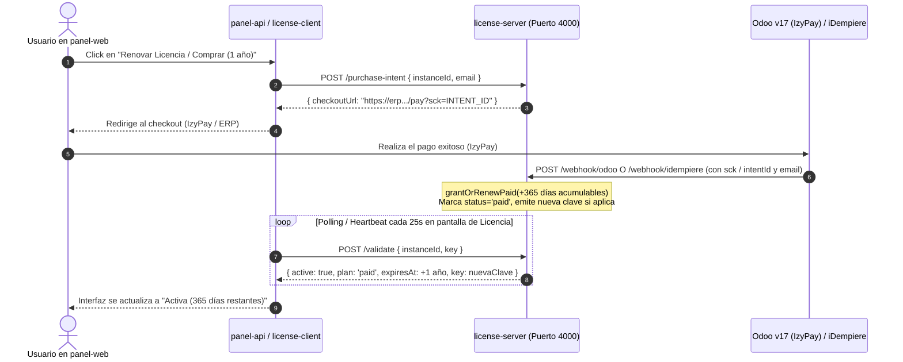

# Plan de Implementación: Mejoras en la Capa de Licenciamiento (Wootrico v2)

Este documento detalla la estrategia de arquitectura e implementación para abordar las dos necesidades planteadas:
1. **Fase 1 (Inmediata / QA & Dev)**: Flexibilización de tiempos de licencia en entornos de desarrollo, QA y auto-hospedados (Open Source) para pruebas sin interrupciones.
2. **Fase 2 (Comercial / ERP)**: Integración de cobros de licencias mediante APIs/Webhooks propios (comparativa y arquitectura entre **Odoo v17 + IzyPay** y **iDempiere REST + Standard Webhooks**).

---

## 1. Fase 1: Flexibilización de Tiempos (Desarrollo, QA y Open Source)

### 1.1. Diagnóstico del Problema Actual
Actualmente, el sistema impone restricciones temporales estrictas y asume que cualquier clave sin fecha de vencimiento (`expiresAt == null`) está expirada:
- `packages/license-client/src/state-machine.ts`: bloquea si `now >= expiresAt` o si la instancia pasa más de 48 horas desconectada (`offlineGraceMs`).
- `apps/license-server/src/server.ts`: en `keyStatus()` y `liveKeyFilter()`, `!lk.expiresAt` se evalúa como `active: false, reason: 'expired'`.
- En entornos locales de QA o pruebas unitarias/E2E, si no se tiene desplegado el `license-server`, el sellado criptográfico `L1:` falla porque no existe un `licenseSecret`, impidiendo descifrar tokens de Chatwoot y proveedores.

### 1.2. Solución Propuesta para Fase 1
Implementar soporte de **Licencias Perpetuas / Modo Community & Developer**:
1. **Nuevo Plan `community` (o `developer`)**:
   - Agregado al enum `LicensePlan` en [packages/config/src/constants.ts](file:///d:/BDeveloper/ChatComunication/wootrico-egs/packages/config/src/constants.ts).
   - En este plan, `expiresAt` puede ser `null` o una fecha muy lejana (e.g., año 2099), indicando validez indefinida.
2. **Actualización de la Máquina de Estados ([state-machine.ts](file:///d:/BDeveloper/ChatComunication/wootrico-egs/packages/license-client/src/state-machine.ts))**:
   - Si `state.plan === 'community'` o `state.expiresAt === null` (o si `process.env.LICENSE_DEV_MODE === 'true'`), no se evalúa el bloqueo por vencimiento temporal.
   - En modo developer/offline (`LICENSE_DEV_MODE=true` o `LICENSE_OFFLINE_GRACE=infinite`), se omite el bloqueo de 48h (`offlineGraceMs`), permitiendo entornos air-gapped o de QA desconectados.
3. **Compatibilidad con Sellado Criptográfico `L1:`**:
   - Cuando se use una clave `community` provisionada por el servidor, este emitirá normalmente un `secret`, manteniendo intacto el cifrado AES-256-GCM + HKDF.
   - En modo autónomo (`LICENSE_DEV_MODE=true` sin servidor de licencias), se derivará automáticamente un secreto determinista local (e.g. `HKDF(APP_ENCRYPTION_KEY, 'wootrico-dev-community')`), garantizando que `decryptSecretAny()` y las credenciales funcionen sin errores en los tests de QA.
4. **Soporte en Servidor de Licencias ([apps/license-server/src/server.ts](file:///d:/BDeveloper/ChatComunication/wootrico-egs/apps/license-server/src/server.ts))**:
   - Ajustar `keyStatus()` y `liveKeyFilter()` para que reconozcan claves `community` o con `expiresAt = null` como **eternamente activas**.
   - En el panel de administración ([apps/license-admin-web](file:///d:/BDeveloper/ChatComunication/wootrico-egs/apps/license-admin-web)), permitir conceder licencias de plan `community` con vigencia ilimitada.

```mermaid
graph TD
    A[Evaluación de Licencia: computeStatus] --> B{¿Plan 'community' O LICENSE_DEV_MODE?}
    B -- Sí --> C[Omitir verificación de expiresAt]
    C --> D{¿LICENSE_DEV_MODE O plan 'community'?}
    D -- Sí --> E[Tolerancia offline permanente]
    E --> F[Estado: ACTIVE]
    B -- No --> G{¿now >= expiresAt?}
    G -- Sí --> H[Estado: BLOCKED (expired)]
    G -- No --> I{¿Desconexión > 48h?}
    I -- Sí --> J[Estado: BLOCKED (offline)]
    I -- No --> F
```

---

## 2. Fase 2: Integración de Cobros con APIs / Webhooks Propios

### 2.1. Análisis Comparativo: Odoo v17 vs. iDempiere

| Criterio | Odoo v17 + IzyPay | iDempiere REST + Standard Webhooks |
|---|---|---|
| **Pasarela de Pago** | **Ya integrada y operativa** con IzyPay (tarjetas de crédito/débito, QR, pasarelas locales). | Requiere pasarela externa o conciliación manual de pagos antes de completar la orden. |
| **Flujo de Checkout** | Redirección directa al portal de pago de Odoo (`/shop/payment` o link de pago IzyPay). | Requiere crear la orden vía `POST /api/v1/models/c_order` y redirigir a un terminal POS/link externo. |
| **Notificación de Pago** | **Webhook Automático (Acción Automatizada)** al confirmar pago (`sale.order` o `account.payment`). | **Standard Webhooks (Outbound)** configurado en `C_Order` con evento `DACO` (Document After Complete). |
| **Seguridad de Webhook** | Token Bearer (`WHK-...`) o firma secreta en headers. | Envelope [Standard Webhooks](https://www.standardwebhooks.com) firmado con HMAC-SHA256 (`webhook-signature`, `whsec_...`). |
| **Tiempo de Salida a Producción** | **Rápido (Recomendado)**: Aprovecha el flujo transaccional ya probado con IzyPay. | Requiere configurar el plugin `com.trekglobal.idempiere.rest.api`, roles, BPartner y SysConfig en iDempiere. |

> [!TIP]
> **Recomendación Técnica**:
> Para el cobro en línea a clientes finales, **Odoo v17 + IzyPay es la ruta más rápida y sólida**, ya que la pasarela ya valida los fondos y emite el recibo/factura.
> Sin embargo, la arquitectura del `license-server` debe ser **agnóstica**: se construirá un módulo de webhooks modular que soporte tanto las notificaciones de Odoo como las de iDempiere (Standard Webhooks).

### 2.2. Flujo de Activación/Renovación Automatizada (1 Año)



---

## 3. Plan de Cambios Propuestos por Componente

### 3.1. Fase 1: Flexibilización para Desarrollo y QA

#### [MODIFY] [packages/config/src/constants.ts](file:///d:/BDeveloper/ChatComunication/wootrico-egs/packages/config/src/constants.ts)
- Extender `LICENSE_PLANS` para incluir `'community'` y `'developer'`:
  ```typescript
  export const LICENSE_PLANS = ['trial', 'paid', 'community', 'developer'] as const;
  export type LicensePlan = (typeof LICENSE_PLANS)[number];
  ```

#### [MODIFY] [packages/license-client/src/state-machine.ts](file:///d:/BDeveloper/ChatComunication/wootrico-egs/packages/license-client/src/state-machine.ts)
- Actualizar `computeStatus()`:
  - Si `process.env.LICENSE_DEV_MODE === 'true'` o `state.plan === 'community'` o `state.plan === 'developer'`:
    - No bloquear si `expiresAt` es nulo o pasó la fecha.
    - Omitir bloqueo estricto por `offlineGraceMs` cuando esté configurado en modo dev o community.

#### [MODIFY] [packages/license-client/src/store.ts](file:///d:/BDeveloper/ChatComunication/wootrico-egs/packages/license-client/src/store.ts)
- En `getLicenseSecret()` / `getLicenseSecrets()`, agregar un fallback determinista cuando `LICENSE_DEV_MODE === 'true'` y la base de datos no contenga un secreto remoto, para que QA pueda levantar contenedores aislados sin un servidor de licencias.

#### [MODIFY] [apps/license-server/src/server.ts](file:///d:/BDeveloper/ChatComunication/wootrico-egs/apps/license-server/src/server.ts)
- En `keyStatus()`, aceptar claves con `plan in ['community', 'developer']` o `expiresAt === null` como activas de por vida.
- En `liveKeyFilter()`, incluir claves perpetuas sin `expiresAt`.
- En `/admin/free-licenses`, permitir conceder planes `'community'` (perpetuos sin fecha de expiración obligatoria).
- En `/admin/keys/:id/set-expiry`, permitir establecer `expiresAt: null` para convertir cualquier clave a perpetua.

---

### 3.2. Fase 2: Módulo de Webhooks Propios (Odoo & iDempiere)

#### [NEW] `apps/license-server/src/webhooks/odoo.ts`
- Ingress para webhooks de Odoo v17 tras el cobro por IzyPay:
  - Autenticación por firma HMAC o Bearer token configurado en Odoo.
  - Extracción del `sck` (identificador de `PurchaseIntent`) y correo del comprador.
  - Ejecución de `grantOrRenewPaid()` sumando 365 días a la clave del cliente.

#### [NEW] `apps/license-server/src/webhooks/idempiere.ts`
- Ingress para Standard Webhooks emitidos por iDempiere:
  - Verificación de cabeceras `webhook-id`, `webhook-timestamp` y `webhook-signature` con el secreto `whsec_...` configurado en iDempiere.
  - Soporte de eventos de órdenes completadas (`DACO` en `C_Order`).
  - Conciliación de la orden con el `PurchaseIntent` y extensión de vigencia por 1 año.

#### [MODIFY] [apps/license-server/src/server.ts](file:///d:/BDeveloper/ChatComunication/wootrico-egs/apps/license-server/src/server.ts)
- Registrar las rutas `/webhook/odoo` y `/webhook/idempiere`.
- En `/admin/settings`, añadir campos editables para `odooWebhookSecret` y `idempiereWebhookSecret` en la tabla `ServerSettings`.

---

## 4. Plan de Verificación y Pruebas

### 4.1. Verificación de Fase 1 (Dev / QA)
1. **Prueba Unitaria de la Máquina de Estados**:
   - Crear un script de prueba o ejecutar con claves `community` y verificar que `computeStatus()` devuelva `'active'` incluso con fecha pasada o nula.
2. **Prueba con `LICENSE_DEV_MODE=true`**:
   - Levantar `panel-api` y `worker` con `LICENSE_DEV_MODE=true`.
   - Verificar que los webhooks de WhatsApp y Chatwoot sean aceptados (`accepted: true`).
   - Crear una integración y comprobar que las credenciales se sellan y descifran correctamente sin servidor de licencias.
3. **Prueba E2E existente**:
   - Ejecutar `node --env-file-if-exists=.env scripts/m4-e2e.mjs` para garantizar que las pruebas de activación, revocación y heartbeat sigan pasando al 100%.

### 4.2. Verificación de Fase 2 (Webhooks de Cobro)
1. **Simulación de Webhook de Odoo**:
   - Enviar payload POST simulando la confirmación de pago de IzyPay con el `sck` del intent.
   - Validar que la clave asociada pase de `trial` a `paid` (+365 días) en la base de datos de licencias.
2. **Simulación de Standard Webhook de iDempiere**:
   - Generar payload firmado con HMAC-SHA256 (`whsec_...`) simulando `DACO` de `C_Order`.
   - Validar verificación de firma y renovación automática.
